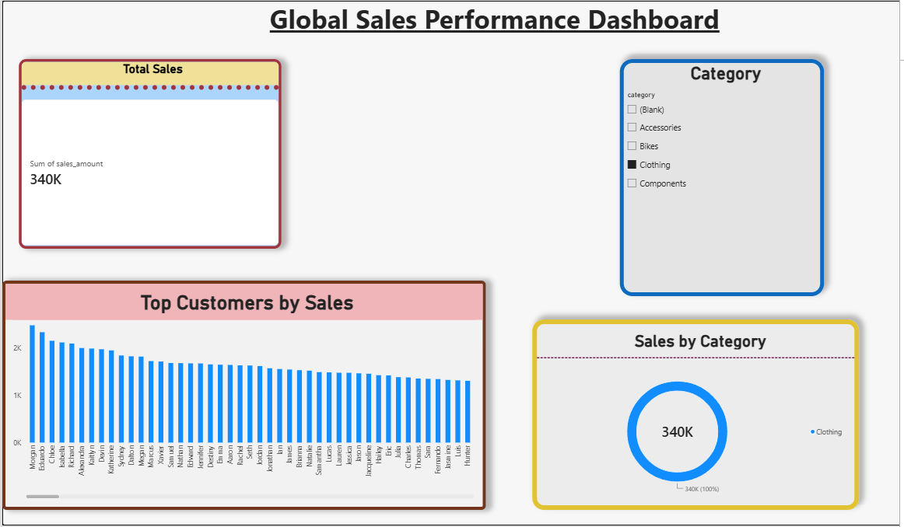

# Global Sales Performance Dashboard

A professional, executive-level Power BI sales analytics dashboard designed to track revenue performance, customer rankings, and product category trends using a modern data model.

---

## 🚀 Dashboard Preview

---

## 📊 Key Features

* **Real-Time KPI Tracking:** Instant visibility into total enterprise revenue and high-level sales metrics.
* **Customer Performance Ranking:** Detailed ranking breakdown evaluating top-performing customers by total sales volume.
* **Interactive Filtering:** Dynamic category slicers that instantly filter and cross-highlight all visual elements on the page.
* **Category Proportions:** Visual breakdown tracking sales distribution across multiple product categories (Accessories, Bikes, Clothing, Components).
* **Modern UI/UX Design:** Built following modern dashboard design principles featuring floating cards, clean typography, custom headers, and subtle drop shadows.

---

## 📁 Project Structure

This is a brief explanation of the files included in this repository:

| File / Component | Description |
| :--- | :--- |
| **Sales Dashboard.pbix** | The core Power BI project file containing the data model, measures, and visual layouts. |
| **dashboard-preview.png** | High-resolution visual export of the dashboard for portfolio showcase. |

---

## 🛠️ Tech Stack & Tools

* **Power BI Desktop:** Core reporting and data visualization environment.
* **DAX (Data Analysis Expressions):** Used for calculating metrics and aggregations.
* **Data Modeling:** Star schema architecture connecting dimension tables (`customers`, `products`) with fact tables (`sales`).

---

## 👤 Project Creator

* **Aishwarya H.** 

Made with ❤️ for the data analytics community.
